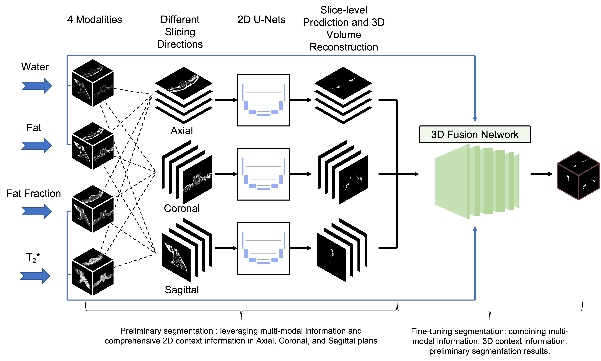

# BAT-Net
Code for paper titled "Automated segmentation of the human supraclavicular fat depot via deep neural network in water-fat separated magnetic resonance images" 

## A sketch of the developed deep learning methods:

An overview of the whole network. It consists of three combining 2D U-Net-like networks and a 3D fusion network to mimic the manual workflow of characterizing BAT regions and to efficiently encode the multi-modal information and extract the 3D context information from multi-modal MRI scans for the segmentation of the BAT. The three combining 2D networks leverage multi-modal information and comprehensive 2D context information in axial, coronal, and sagittal planes to conduct the preliminary segmentation and the 3D fusion network combines multi-modal information, 3D context information and preliminary segmentation results for obtaining a fine-tuned segmentation.

An example with MR images of all modalities and manual annotation is given in example/.

Pre-trained model checkpoints are stored at our [Google Drive Folder](https://drive.google.com/drive/folders/1-myy3VFzUGUEjBje50m_Pu2beqZlhM8g?usp=sharing).

## Requirement:
  > Python 2.7.3  
  > tensorflow 1.9.0  
  > Keras 2.2.2  
  > keras-contrib 2.0.8  
  > pandas 0.24.2  
  > scikit-image 0.14.0  
  > scikit-learn 0.19.2  
  > SimpleITK 1.1.0  

## Guideline for utilizing:

### Image and Label pre-processing:

(1) Data should be organized as:
    
    your/data/directory/ 
        /FF/*.nii      # Fat Fraction modality 
        /T2S/*.nii     # T2* modality
        /F/*.nii       # Fat modality
        /W/*.nii       # Water modality
        /Labels/*.nii  # Manual annotation
(2) Run data preprocessing    

    python preprocessing.py 
    --data-directory your/data/directory/
    
       
        
### Three-combining 2D segmentation network component:

(1) Editor /Three_combining_2D_segmentation_network/config.py file:

    Edit config file to assign parameters such as GPU device (A sample config are provided).

        
(2) Training data and test data split can be assigned as follows:
    
    # Training data
    your/2D/project/directory/   
        TrainingData/FF.txt     # Fat Fraction modality  
        TrainingData/T2S.txt    # T2* modality
        TrainingData/F.txt      # Fat modality  
        TrainingData/W.txt      # Water modality 
        TrainingData/Label.txt  # Manual annotation

    # Test data
    your/2D/project/directory/
        TestData/FF.txt     # Fat Fraction modality  
        TestData/T2S.txt    # T2* modality
        TestData/F.txt      # Fat modality  
        TestData/W.txt      # Water modality
       

(3) Data preparing    

    python /Three_combining_2D_segmentation_network/DataPrepare.py 
    --image-data-directory your/data/directory/
    --project-folder your/2D/project/directory/

(4) training the model:
    
    python /Three_combining_2D_segmentation_network/TrainAndPredict.py 
    --project-folder your/2D/project/directory/ 
    --mode 'train' 
    --overwrite

(5) predicton on the unseen data (Optional, can be utilized when evaluating the performance of the 2D network):
    
    python /Three_combining_2D_segmentation_network/TrainAndPredict.py 
    --project-folder your/2D/project/directory/ 
    --mode 'test' 

(6) Post-Processing and evaluation (2D)) (Optional, can be utilized when evaluating the performance of the 2D network):

    python /Three_combining_2D_segmentation_network/PostAndEval.py
    --project-folder your/2D/project/directory/
    --reference-image-path your/reference/image   # An image used for setting the origin, spacing and direction of output images.

### 3D fusion network component:

(1) Editor /ThreeD_fusion_net/config.py file:

    Setup the seed and other parameters in /ThreeD_fusion_net/config.py. please save the changes before next step. (A sample config are provided).
    
(2) Training data and test data split can be assigned as follows:
    
    # Training data
    your/combine-net/project/directory/   
        TrainingData/FF.txt     # Fat Fraction modality  
        TrainingData/T2S.txt    # T2* modality
        TrainingData/F.txt      # Fat modality  
        TrainingData/W.txt      # Water modality
        TrainingData/pred_x.txt # 2D predictions of sagittal plane
        TrainingData/pred_y.txt # 2D predictions of coronal plane
        TrainingData/pred_z.txt # 2D predictions of axial plane
        TrainingData/Label.txt  # Manual annotation

    # Test data
    your/combine-net/project/directory/
        TestData/FF.txt     # Fat Fraction modality  
        TestData/T2S.txt    # T2* modality
        TestData/F.txt      # Fat modality  
        TestData/W.txt      # Water modality
        TestData/pred_x.txt # 2D predictions of sagittal plane
        TestData/pred_y.txt # 2D predictions of coronal plane
        TestData/pred_z.txt # 2D predictions of axial plane

(3) Data preprocessing:  
    
    python ThreeD_fusion_net/preprocessing.py --project-folder your/combine-net/project/directory/
    
(4) training the model: 
    
    python ThreeD_fusion_net/train.py

(5): predicton on the unseen data:
    
    python ThreeD_fusion_net/predict.py
    
(6): performance evaluation
    
    python ThreeD_fusion_net/evaluate.py
