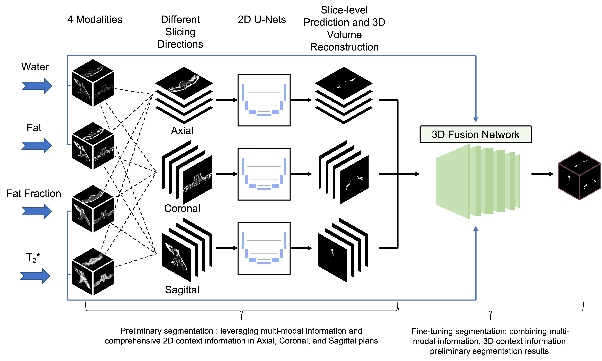

# BAT-Net
Code for paper titled "Automated segmentation of the human supraclavicular fat depot via deep neural network in water-fat separated magnetic resonance images" 

# A sketch of the developed deep learning methods:

An overview of the whole network. It consists of three combining 2D U-Net-like networks and a 3D fusion network to mimic the workflow of physicians for characterizing BAT regions and to efficiently encode the multi-modal information and extract the 3D context information from multi-modal MRI scans for the segmentation of the BAT. The three combining 2D networks leverage multi-modal information and comprehensive 2D context information in axial, coronal, and sagittal planes to conduct the preliminary segmentation and the 3D fusion network combines multi-modal information, 3D context information and preliminary segmentation results for obtaining a fine-tuning segmentation.

# Requirement:
  > Python 2.7.3  
  > tensorflow 1.9.0  
  > Keras 2.2.2  
  > keras-contrib 2.0.8  
  > pandas 0.24.2  
  > scikit-image 0.14.0  
  > scikit-learn 0.19.2  
  > SimpleITK 1.1.0  

# Guideline for utilizing:

# Three-combining 2D segmentation network component:

(1) Editor /Three_combining_2D_segmentation_network/config.py file:

    Edit config file to assign parameters such as GPU device (A sample config are provided).

(2) Data should be organized as:
    
    Input_directory_path:    
        /data/FF/ # Fat Fraction modality
            /*.nii    
        data/T2S/ # T2* modality
            /*.nii       
        data/F/ # Fat modality
            /*.nii   
        data/W/ # Water modality
            /*.nii   
        data/Labels/ # Manual annotation
            /*.nii   
    
(3) Training data and test data split can be assigned as follows:
    
    # Training data
    Input_directory_path:    
        TrainingData/FF.txt # Fat Fraction modality  
        TrainingData/T2S.txt # T2* modality
        TrainingData/F.txt # Fat modality  
        TrainingData/W.txt # Water modality 
        TrainingData/Label.txt # Manual annotation

    # Test data
    Input_directory_path:    
        TestData/FF.txt # Fat Fraction modality
        TestData/T2S.txt # T2* modality 
        TestData/F.txt # Fat modality
        TestData/W.txt # Water modality
        TestData/Label.txt # Manual annotation

(4) Data preparing    

    python /Three_combining_2D_segmentation_network/prepare_data.py 
    --data_folder Input_directory_path 
    --project_folder project_folder

(4) training the model:
    
    python /Three_combining_2D_segmentation_network/main.py 
    --project_folder project_folder 
    --mode 'train' 
    --learning_rate 0.0001 
    --epochs 100 
    --batch_size = 30

(5) predicton on the unseen data (Optional, can be utilized when evaluating the performance of the 2D network):
    
    python /Three_combining_2D_segmentation_network/main.py 
    --project_folder project_folder 
    --mode 'test' 

(6) Post-Processing and evaluation (2D)) (Optional, can be utilized when evaluating the performance of the 2D network):

    python post_processing_and_evaluation.py
    --data_folder Input_directory_path 
    --project_folder project_folder

# 3D fusion network component:

(1) Editor /ThreeD_fusion_net/config.py file:

    Setup the seed and other parameters in /ThreeD_fusion_net/config.py. please save the changes before next step. (A sample config are provided).

(2) Data preprocessing:  
    
    python ThreeD_fusion_net/preprocessing.py --input_data_root Input_directory_path

(3) training the model: 
    
    python ThreeD_fusion_net/train.py
    --learning_rate 0.0001 
    --epochs 39 
    --batch_size = 8

(4): predicton on the unseen data:
    python ThreeD_fusion_net/predict.py --output_folder project_directory_path

(5): performance evaluation
    python ThreeD_fusion_net/evaluate_bat.py --output_folder project_directory_path

(6): Postprocessing3D

    python ThreeD_fusion_net/Postprocessing3D.py --input_folder project_directory_path --output_folder project_directory_path